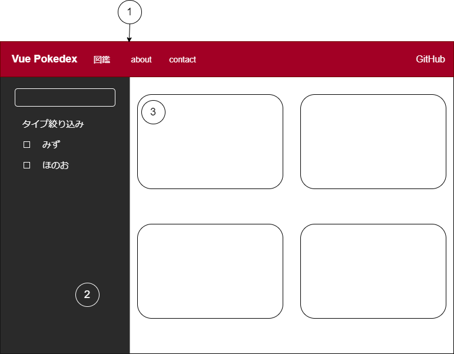

# ポケモン図鑑画面設計書

## ① ヘッダー

ポケモン図鑑とAboutとContactとGitHubへのリンクを付ける。  
Vue Pokedexの文字をクリックするとポケモン図鑑のページに飛ぶ

[vuetifyのv-app-bar](https://vuetifyjs.com/ja/components/app-bars/)を使用する

## ② 検索サイドメニュー

[vuetifyのmini-variant](https://vuetifyjs.com/ja/components/navigation-drawers/#mini-variant)を使用し、可変のサイドメニューを作成する。

- 名前による検索
- タイプによる絞り込み

が出来る。ずかん番号での絞り込みもあると便利かなと思う(暇があれば)。

## ③ ポケモン詳細

各ポケモンの画像と名前、タイプが表示される。

クリックすると[dialog](https://vuetifyjs.com/ja/components/dialogs/)が表示され、ポケモンのスプライトとステータスが表示される。
